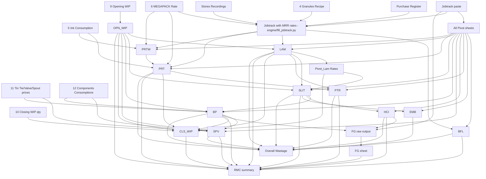

# SYSTEM ARCHITECTURE — Auto-Fill `Base RMC` Workbook

> **Mission.** Given the Unfilled `1 Base RMC _ 2026 February.xlsx` plus the 11 supporting workbooks and the monthly Job Track, deterministically reproduce the Filled output **byte-equivalent in numerical results** to `Filled_Output\1 Base RMC _ 2026 February.xlsx`, with **`RMC summary`** matching exactly.

---

## 0. TL;DR — How the Workbook Actually Works

The workbook is **NOT** a chain of black boxes. It is a layered formula spreadsheet:

1. **Raw layer (input):** `Jobtrack` is pasted as-is from `Job Track Feb 26.xlsx`. It is the single physical source of every kilogram, meter, and wastage value.
2. **Pivot layer:** Each `Pivot (X)` sheet is a static *PivotTable copy* of Jobtrack filtered by Process. Process sheets reference these pivots through right-side mirror columns (`=+A7`, `=+B7`, …).
3. **Process layer (8 sheets):** `BFL`, `Print` / `Printing Work`, `Lam`, `Slit`, `Bag&Pouch`, `Spout&Valve`, `PTR Rew`, `HCI Rew`, `Embossing` each take pivot rows + an injected **Rate** and compute Value, Wastage Qty, Wastage Value per order.
4. **WIP layer:** `OPN_WIP` (last-month closing → this-month opening) is pasted from file 9. `CLS_WIP` is computed: quantities pasted from file 10, **rates re-derived** from this-month process sheets via XLOOKUP, value = qty × rate.
5. **FG layer:** `FG` lists every unique Order in Jobtrack, joins HCI-Rewinder wastage, and reports `Final FG = Net Wt − HCI Rew Wastage`.
6. **Aggregation layer:** `RMC summary` runs `SUMIF` on Order No into all the layers above to compute Total Cost and RMC/Kg per order.
7. **Reporting layer:** `Overall Wastage - Process Wise` aggregates by process; standalone read-only.

Once you understand this stack, the implementation is mechanical.

---

## 1. THE 27-SHEET MAP (Authoritative)

| # | Sheet | Layer | What it stores | Rate column | Trigger formulas |
|---|-------|-------|----------------|-------------|------------------|
| 0 | `BFL` | Process | Extrusion (Blown Film Lamination) | `O` (Poly Rate) | `N=O*L`, `Q=O*P`, `V=Q` |
| 1 | `Pivot (BFL)` | Pivot | Mirror of BFL pivot from Jobtrack | — | `=+A7` style mirrors |
| 2 | `Embossing` | Process | Embossing rolls | `N` (rate) | `O=N*K`, `Q=N*P` |
| 3 | `Pivot (E)` | Pivot | Embossing pivot | — | mirrors |
| 4 | `Spout&Valve` | Process | Spout / Valve / Tin-Tie components | `I` (RMC rate from Bag&Pouch), `N`/`S`/`X` (component prices) | `J=I*H`, `O=N*AB`, `T=S*AB`, `Y=X*AB` |
| 5 | `Pivot (Spout&Valve)` | Pivot | Spout&Valve pivot | — | mirrors |
| 6 | `Bag&Pouch` | Process | Bag/Pouch making | `Q` (computed from Slit) | `R=(Q*I)+(J*11.85)+(K*L)` |
| 7 | `Pivot (B & P)` | Pivot | Bag&Pouch pivot | — | mirrors |
| 8 | `PTR Rew` | Process | PTR Rewinder | `N`/`U`/`AB` (lookups to Print/Lam/Fresh) | `O=N*M` etc. |
| 9 | `Pivot (PTR Rew)` | Pivot | PTR Rew pivot | — | mirrors |
| 10 | `Pivot_Lam Rates` | Pivot | Per-order, per-LamPass weighted-avg rate (used by Slit) | `F` (Avg Rate = D/C) | manual aggregate |
| 11 | `Slit` | Process | Slitting | `N` (Input RMC/Kg) | `O=N*K`, `Q=N*P` |
| 12 | `Pivot (S)` | Pivot | Slit pivot | — | mirrors |
| 13 | `Lam` | Process | Lamination (largest, most complex) | `AA` (Ptd Mat Rate), `AD` (Lam Mat Rate), `AG`/`AJ` (Fresh rates), `AN` (Adh), `AR` (Hard), `AW` (Solv) | massive — see §3.2 |
| 14 | `Pivot (L)` | Pivot | Lam pivot | — | mirrors |
| 15 | `Print` | Process | Printing summary view | `Y` (Ink Rate/kg) | `N=L/M`, `R=Q*T` |
| 16 | **`RMC summary`** | **OUTPUT** | One row per order (or order-group) | — | SUMIF/VLOOKUP into all process sheets — see §2 |
| 17 | `prnt wrkg pivot` | Pivot | Printing pivot | — | mirrors |
| 18 | `Printing Work` | Process | Printing detailed work | `N` (Film), `Y`(Ink) | `R=Q*T` |
| 19 | `Pivot (P)` | Pivot | Printing pivot | — | mirrors |
| 20 | `HCI Rew` | Process | HCI Rewinder | `J` (rate from Slit) | `K=I*J` |
| 21 | `Pivot (HCI Rew)` | Pivot | HCI Rew pivot | — | mirrors |
| 22 | **`Jobtrack`** | **INPUT** | Raw paste of Job Track Feb 26 | — | (data only) |
| 23 | `FG` | FG | Per-order finished goods (output - HCI Rew waste) | — | `G=B-F` |
| 24 | `Overall Wastage - Process Wise` | Report | Process-level wastage rollup | — | direct cell refs |
| 25 | `OPN_WIP` | WIP | Pasted from `9 Opening WIP Stock.xlsx` | `I` (last-month rate) | `A` is composite key (see §4.1), `J=I*H` |
| 26 | `CLS_WIP` | WIP | Qty pasted from file 10, rate computed | `I` (computed) | `I=IF(A=B&"Pm", XLOOKUP(B,Print!B,Print!N, OPN_WIP rate), …)` (cascade) |

---

## 2. THE `RMC summary` SHEET — Exact Reverse Engineering

### 2.1 Layout (rows of the sheet)

| Row | Role |
|-----|------|
| 1 | Title macro + sticky helper formulas (`L1`, `T1`, `X1`) |
| 2 | Total FILM consumption summary |
| 3 | Reconciliation row (ground truth = `=+J4 − Print!G5` etc.) — used to cross-check that SUMIFs equal the process-sheet SUBTOTALS |
| 4 | `=SUBTOTAL(9, col7:col628)` for every numeric column → page totals |
| 5 | Section header text |
| 6 | **Column headers** (data starts row 7) |
| 7+ | One row per Order (or Order-group) |

### 2.2 Column dictionary (what each column means + how it is filled)

> 🔵 = quantity (Kg) · 🟢 = value (AED) · 🟡 = wastage · 🔴 = analytic / check

| Col | Header | Type | Formula (standard order, n = current row) |
|-----|--------|------|--------------------------------------------|
| `A` | Combined-key (only set for grouped orders, e.g. `L00328/L00334`) | identifier | static text |
| `B` | **Order No** | identifier | static text |
| `C-H` | Design / Customer / Sales / Material / Remarks / Structure | metadata | static text |
| `I` | Opening WIP Kg | 🔵 | `=(IFERROR(SUMIF(OPN_WIP!B:B,B(n),OPN_WIP!H:H),0)) [+ offset]` |
| `J` | Printing Film Input Kg | 🔵 | `=SUMIF(Print!B:B,B(n),Print!G:G) [+0]` |
| `K` | Lam Fresh Mat Kg | 🔵 | `=SUMIF(Lam!B:B,B(n),Lam!AY:AY) [+offset]` |
| `L` | Other Film Input Kg | 🔵 | `0` *or* `=SUMIFS(Slit!K:K,Slit!B:B,B(n),Slit!F:F,F(n))` (single-layer / WPE orders) |
| `M` | Dry Ink Kg | 🔵 | `=SUMIF(Print!B:B,B(n),Print!H:H) [+0]` |
| `N` | Adh+Hard Solids Kg | 🔵 | `=SUMIF(Lam!B:B,B(n),Lam!BA:BA) [+offset]` |
| `O` | Zipper+PE strip+Valve Kg | 🔵 | `=SUMIF('Bag&Pouch'!B:B,B(n),'Bag&Pouch'!Y:Y)+SUMIF('Spout&Valve'!B:B,B(n),'Spout&Valve'!AJ:AJ) [+0]` |
| `P` | Closing WIP Kg | 🔵 | `=IFERROR(SUMIF(CLS_WIP!B:B,B(n),CLS_WIP!H:H),0)` |
| `Q` | Opening WIP Value | 🟢 | `=(IFERROR(SUMIF(OPN_WIP!B:B,B(n),OPN_WIP!J:J),0)) [+offset]` |
| `R` | Printing Film Value | 🟢 | `=SUMIF(Print!B:B,B(n),Print!J:J) [+0]` |
| `S` | Lam Fresh Mat Value | 🟢 | `=SUMIF(Lam!B:B,B(n),Lam!AZ:AZ) [+offset]` |
| `T` | Other Film Value | 🟢 | `0` *or* `=SUMIFS(Slit!O:O,Slit!B:B,B(n),Slit!F:F,F(n))` |
| `U` | Ink & Sol Value | 🟢 | `=SUMIF(Print!B:B,B(n),Print!K:K) [+0]` |
| `V` | Adh+Hard+Sol Value | 🟢 | `=SUMIF(Lam!B:B,B(n),Lam!BB:BB) [+offset]` |
| `W` | Zipper+PE+Valve Value | 🟢 | `=SUMIF('Bag&Pouch'!B:B,B(n),'Bag&Pouch'!Z:Z)+SUMIF('Spout&Valve'!B:B,B(n),'Spout&Valve'!AK:AK) [+0]` |
| `X` | Closing WIP Value | 🟢 | `=IFERROR(SUMIF(CLS_WIP!B:$B,B(n),CLS_WIP!$J:$J),0)` |
| `Y` | Prod / Output Kg | 🔵 | `=(IFERROR(VLOOKUP(B(n),FG!A:G,7,0),0))` (combined orders also add `VLOOKUP(A(n),...)`) |
| `Z` | Total Cost | 🟢 | `=Q+R+S+T+U+V+W − X` |
| `AA` | Prod RMC / Kg | 🟢 | `=IFERROR(Z/Y,0)` |
| `AB` | Diff vs Std | 🔴 | `=AC − AA` |
| `AC` | Standard Rate | metadata | manual entry |
| `AD` | Input/Output check | 🔴 | `=I+J+K+L+M+N+O − P − Y` |
| `AE` | Compare with Net Wastage | 🔴 | `=AS − AD` |
| `AF` | Comments | metadata | manual text |
| `AG/AH/AI` | Last 3 months' remarks | metadata | manual |
| `AJ` | Extr (BFL wastage qty) | 🟡 | `=SUMIF(BFL!B:B,B(n),BFL!P:P) [+offset]` |
| `AL` | Print wastage qty | 🟡 | `=SUMIF(Print!B:B,B(n),Print!Q:Q) [+0]` |
| `AM` | Lam wastage qty | 🟡 | `=SUMIF(Lam!B:B,B(n),Lam!BL:BL) [+offset]` |
| `AN` | Slit wastage qty | 🟡 | `=SUMIF(Slit!B:B,B(n),Slit!P:P) [+offset]` |
| `AO` | Bag&Pouch wastage qty | 🟡 | `=SUMIF('Bag&Pouch'!B:B,B(n),'Bag&Pouch'!P:P) [+0]` |
| `AP` | Spout&Valve wastage qty | 🟡 | `=SUMIF('Spout&Valve'!B:B,B(n),'Spout&Valve'!AC:AC) [+0]` |
| `AQ` | HCI Rew wastage qty | 🟡 | `=SUMIF('HCI Rew'!B:B,B(n),'HCI Rew'!I:I) [+0]` |
| `AR` | PTR Rew wastage qty | 🟡 | `=SUMIF('PTR Rew'!B:B,B(n),'PTR Rew'!AE:AE) [+0]` |
| `AS` | TOTAL wastage qty | 🟡 | `=SUM(AL:AR)` |
| `AU…BB` | Wastage AED **TILL** = Prev + Curr | 🟡 | `=BF + BN` (Extr), `=BG + BO` (Print), … |
| `BC` | Total wastage AED (TILL) | 🟡 | `=SUM(AU:BB)` |
| `BF…BM` | Wastage AED **previous month** | 🟡 | numeric (carry-forward; usually 0; manual offset for prev-month-start orders) |
| `BN` | Extr current-month wastage AED | 🟡 | `=SUMIF(BFL!B:B,B(n),BFL!Q:Q) [+offset]` |
| `BO` | Print current wastage AED | 🟡 | `=SUMIF(Print!B:B,B(n),Print!R:R) [+0]` |
| `BP` | Lam current wastage AED | 🟡 | `=SUMIF(Lam!B:B,B(n),Lam!BJ:BJ) [+offset]` |
| `BQ` | Slit current wastage AED | 🟡 | `=SUMIF(Slit!B:B,B(n),Slit!Q:Q) [+offset]` |
| `BR` | B&P current wastage AED | 🟡 | `=SUMIF('Bag&Pouch'!B:B,B(n),'Bag&Pouch'!S:S) [+0]` |
| `BS` | Spout&Valve current wastage AED | 🟡 | `=SUMIF('Spout&Valve'!B:B,B(n),'Spout&Valve'!AE:AE) [+0]` |
| `BT` | HCI Rew current wastage AED | 🟡 | `=SUMIF('HCI Rew'!B:B,B(n),'HCI Rew'!K:K) [+0]` |
| `BU` | PTR Rew current wastage AED | 🟡 | `=SUMIF('PTR Rew'!B:B,B(n),'PTR Rew'!AF:AF) [+0]` |
| `BX` | RMC echo | 🟢 | `=+Z` |
| `BY` | Overall Consumption Kg | 🔵 | `=+SUM(I:O) − P` |

> The headers at row 6 are reproduced verbatim from the file. **Column letters are stable across months** — formulas always reference these letters and never auto-shift.

### 2.3 The five row-level "remarks" cases (and the offset rule)

The `Remarks` column (`G`) tells you **which formula variant** to write for that row.

| Remarks value | Quantity formula shape | Value formula shape | Where the offsets come from |
|---------------|------------------------|---------------------|------------------------------|
| `Prod start & finish same month` (most rows) | `=SUMIF(...)` *no parens, no offset* | same | — |
| `Closing WIP` | `=(SUMIF(...)) + offsetKg` | `=(SUMIF(...)) + offsetAED` | hardcoded transfer values from previous month's reconciliation; e.g. row 7 has `+240` Kg / `+1949.33…` AED for transfer of 240 kg L2 from B00919 |
| `Prod start prev month, finish this month` | `=((SUMIF(...))) + offsetKg` (extra parens) | same with offsetAED | last month's running WIP balance closing for that order |
| `Transfer` | uses **subtraction** in places (e.g. moving qty out) | same | — |
| `Combined` (col `A` populated, e.g. `L00328/L00334`) | quantities for `B(n)` only; `Y` adds VLOOKUP on both `A` and `B` | values likewise | combined FG join |

> 💡 **Critical insight.** The "+offset" numbers are not magic. They are last month's `RMC summary!I/Q/K/S/N/V/AJ/AM/BN/BP` values for that exact order. When you regenerate a month, the previous month's `RMC summary` is the source.

### 2.4 Other special row patterns

* **Single-layer / WPE orders** (e.g. G00411, F=`WPE`, H=`Single layer`) populate `L` and `T` with `SUMIFS(Slit!K, Slit!B=B, Slit!F=F)` (so the Slit-only film flows through `Other Film Input` instead of through Print/Lam).
* **Combined orders** (col `A` non-empty, e.g. `L00328/L00334`):
  - One physical row in `RMC summary` with `B = L00328`.
  - `Y(n)` becomes `VLOOKUP(A(n),FG!A:G,7,0) + VLOOKUP(B(n),FG!A:G,7,0)` so both component orders sum into output.
  - The **other** order (`L00334`) does NOT get its own row.
  - In `Bag&Pouch`, `OPN_WIP`, `Slit` etc. that order also has col `A` filled with `L00328/L00334` so `RMC summary!Y` can VLOOKUP it.

---

## 3. PROCESS SHEETS — How Each One Is Built

### 3.0 Universal pattern

Every process sheet has:

```
ROW 1  : header tags ('F', 'F+ Prev.', 'VLOOKUP from Incoming Order')
ROW 2  : Month label, optional sheet-level lookups
ROW 3  : Process name (= sheet identity)
ROW 4  : 'Samples / Only Plan / Others' = 'Excluded'
ROW 5  : SUBTOTAL(9, col7:colN)  ← page totals
ROW 6  : column headers
ROW 7+ : data rows (one per Job Track production line, sometimes aggregated)
```

The right-hand side of each Pivot sheet has formula mirrors (`=+A7`,…) used by Job Track to fan data into process sheets.

### 3.1 `Print` / `Printing Work` (sheet 15 / 18) — Printing layer

Source: Printing pivot from Jobtrack (Process="Printing").

| Col | Meaning | Formula |
|-----|---------|---------|
| B-F | Order, Design, Material, Structure, Input Name | from pivot |
| G | Film Input Kg | from pivot (Sum of TOTAL INPUT Kgs) |
| H | Dry Ink Kg | from `5 Ink Consumption February 2026.xlsx` per order |
| I | Total Input | `=G+H` |
| J | Film Value | from Print rate × G (rate = weighted-avg from Lam Ptd Mat — see Pivot_Lam Rates logic, see §3.6) |
| K | Ink Value | `=Y*H` where Y is ink rate per kg |
| L | Total Value | `=SUM(J:K)` |
| M | Output Kgs | from pivot |
| N | RMC/kg | `=L/M` |
| O,P | Output Meters, Sq Mtrs | from pivot |
| Q | Wastage Qty Calc | `=I − M` (or pivot wastage) |
| R | Wastage Value | `=Q*T` |
| S | Wastage % | `=Q/I` |
| T | Input RMC | `=L/I` |
| U | Waste Qty (log sheet) | reference value |
| Y | Ink Rate per kg | `=K/H` |

`Printing Work` (sheet 18) is the original detailed working sheet; `Print` (sheet 15) is a **summarised** copy where row 4 contains formulas like `G4 = G5 - 'Printing Work'!L5` (i.e. checks that sum of Print equals sum of Printing Work).

### 3.2 `Lam` (sheet 13) — the most complex sheet

640+ rows × 85 columns. Each row = one Lam production entry from the Lam pivot.

**Input section (B–V):** Order, Design, Date, Machine (`E`), Material, Structure, **Lam Process** (`H` ∈ {L1,L2,L3}), Next Dept (`I`), Sleeve size (`J`), then four input-material slots — Ptd Mat (K-M: name/size/mic), Lam Mat (N-P), 1st Fresh (Q-S), 2nd Fresh (T-V) — and consumables: Adh Name (`W`), Hard Name (`X`), Adh GSM (`Y`).

**Quantity & Rate section (Z–AS):**

| Col | Meaning | Formula |
|-----|---------|---------|
| Z | Ptd Mat Qty | manual from pivot |
| AA | Ptd Mat Rate | `=XLOOKUP(B&"Pm", OPN_WIP!A, OPN_WIP!I)` (i.e. inherit from last month) |
| AB | Ptd Mat Value | `=AA*Z` |
| AC | Lam Mat Qty | manual |
| AD | Lam Mat Rate | `=XLOOKUP(B&"Lm"&N, OPN_WIP!A, OPN_WIP!I)` (Lam Mat suffix is `LmL1` etc.) |
| AE | Lam Mat Value | `=AD*AC` |
| AF | 1st Fresh Mat Qty | manual from pivot |
| AG | 1st Fresh Mat Rate | manual (weighted-avg from Purchase Register — see §5) |
| AH | 1st Fresh Value | `=AG*AF` |
| AI | 2nd Fresh Mat Qty | manual |
| AJ | 2nd Fresh Mat Rate | manual |
| AK | 2nd Fresh Value | `=AJ*AI` |
| AL | Adh Qty | manual from Adh consumption |
| AM | Adh Solids Qty | manual |
| AN | Adh Rate | manual (from Purchase Register) |
| AO | Adh Value | `=AN*AL` |
| AP | Hard Qty | manual |
| AQ | Hard Solids Qty | manual |
| AR | Hard Rate | manual |
| AS | Hard Value | `=AR*AP` |

**Roll-up section (AT–BB):**

| Col | Meaning | Formula |
|-----|---------|---------|
| AT | Adh+Hard (Solids) | `=AM+AQ` |
| AU | Adh+Hard (Calc) | `=(Y*J*BG)/10^6` (consumption from GSM × sleeve × Mtrs) |
| AV | Solv Qty | manual |
| AW | Solv Rate | manual constant from Stores (e.g. 3.038…) |
| AX | Solv Value | `=AW*AV` |
| **AY** | **Fresh Mat Qty** | `=AF+AI` ← **RMC summary K** SUMIFs this |
| **AZ** | **Fresh Mat Value** | `=AH+AK` ← **RMC summary S** |
| **BA** | **Adh+Hard Solids Qty** | `=AT` ← **RMC summary N** |
| **BB** | **Adh+Hard+Solv Value** | `=AO+AS+AX+BN+BP` ← **RMC summary V** |

**Output & wastage section (BC–CB):**

| Col | Meaning | Formula |
|-----|---------|---------|
| BC | Total Input Qty | manual |
| BD | Total Input Val | `=AB+AE+AH+AK+AO+AS+AX+BN+BP` |
| BE | Output Kgs | manual from pivot |
| BG | Output (Mtrs) | manual |
| BH | Prod (Sq Mtr) | `=BG*J/1000` |
| BI | Wastage Total | `=BL+BO` ← (sums Lam-clean + Adh/Hard wastage) |
| **BJ** | **Wastage AED** | `=BL*BD/BC + BN + BP` ← **RMC summary BP** |
| BK | Wastage % | `=BI/BC` |
| **BL** | **Wastage Calc Qty** | manual ← **RMC summary AM** |
| BM | Lam Solv-clean Wastage Qty | manual |
| BN | Lam Solv-clean Wastage Value | `=BM*AW` |
| BO | ADH+HARD Wastage Qty | manual |
| BP | ADH+HARD Wastage Value | `=CB` |
| BV-BX | Adhesive Waste split (per Adh name lookup) | giant nested IF on `W` (adhesive name) |
| BZ-CB | Adhesive/Hardener Waste Value | `BZ=BV*AN`, `CA=BW*AR`, `CB=SUM(BZ:CA)` |

> 🔑 **Sub-process key** for matching with WIP: `B & H` ⇒ `B01065 + L1` etc. is used by Slit's `Z` column to look back into Lam's BE and verify quantities.

### 3.3 `Slit` (sheet 11) — slitting

| Col | Meaning | Formula |
|-----|---------|---------|
| B-J | Order, Design, Date, M/c, Material, Structure, Input ('L1'/'L2'), Input Size mm, Input Mic | from pivot |
| K | Input Kgs | from pivot |
| L | Output Kgs | from pivot |
| M | Input Mtrs | from pivot |
| **N** | **Input RMC/Kg** | `=XLOOKUP(B&"Lg", OPN_WIP!A, OPN_WIP!I)` (when input came from prev-month WIP) **or** `=XLOOKUP(B&H, 'Pivot_Lam Rates'!H, 'Pivot_Lam Rates'!F)` (when input was made this month) **or** hardcoded number (when neither) |
| O | Slitting Input Val | `=N*K` |
| P | Wastage Kgs | manual (from pivot) |
| Q | Wastage Val (AED) | `=P*N` |
| R | Wastage % | `=Q/O` |
| T | Output RMC/KG | `=O/L` |
| Z | last-month WIP qty check | `=VLOOKUP(B&"LG", OPN_WIP!A:H, 8, 0)` |
| AA | this-month Lam qty check | `=SUMIFS(Lam!BE, Lam!B=B, Lam!H=H)` |
| AB | reconciliation `=Z-AA` | check |

> 🔑 **Crucial source-of-rate decision tree** (this is the single most important rate logic in the workbook):
>
> ```
> If order had OPN_WIP entry with key B&"Lg" (Laminated, waiting for slitting):
>     N = XLOOKUP(B&"Lg", OPN_WIP, OPN_WIP_rate)   ← inherit prev month rate
> Else if order had Lam production this month under same Lam Pass:
>     N = XLOOKUP(B&H, 'Pivot_Lam Rates'!H, 'Pivot_Lam Rates'!F)
>             where Pivot_Lam Rates!F = SUMIF(Lam BD)/SUMIF(Lam BE) per (B,H)
> Else:
>     N = hardcoded (manual entry, very rare)
> ```

### 3.4 `Bag&Pouch` (sheet 6)

| Col | Meaning | Formula |
|-----|---------|---------|
| B-G | Order, Design, M/c, Material, Structure, Input | from pivot |
| H | Zipper Type | from supplementary table |
| I | Input Kgs | from pivot |
| J | PE Strip Qty | manual |
| K | Zipper Qty | manual |
| L | Zipper Rate | from `11 Price of Tin Tie, Valve & Spout 2026 updated.xlsx` (lookup by H) |
| M | Total Input | `=I+J+K` (Pre-costing) |
| N | Output Kgs | manual |
| O | Output Pcs | manual |
| P | Wastage Calc | `=M-N` |
| **Q** | **RMC rate** | `=SUMIFS(Slit!O,Slit!B=B,Slit!H=G)/SUMIFS(Slit!L,Slit!B=B,Slit!H=G)` *or* `=XLOOKUP(B&"Wh", OPN_WIP!A, OPN_WIP!I)` (for prev-month carry) |
| R | Input RMC | `=(Q*I)+(J*11.85)+(K*L)` (PE rate fixed at 11.85) |
| S | Wastage AED | `=P*V` where `V=R/M` |
| T | Wastage % | `=P/M` |
| U | Gms / pc | `=N*1000/O` |
| V | Input RMC/kg | `=R/M` |
| **Y** | **PE Strip + Zipper Qty** | `=J+K` ← **RMC summary O** |
| **Z** | **PE Strip + Zipper Value** | `=(J*11.85)+(K*L)` ← **RMC summary W** |
| AA | Output RMC/kg | `=R/N` |
| AE | OPN_WIP B&"Wh" qty check | `=VLOOKUP(B&"Wh", OPN_WIP!A:H, 8, 0)` |
| AF | This-month Bag input check | `=SUMIFS(I:I, B:B, B(n))` |
| AG | reconciliation | `=AE-AF` |

### 3.5 `Spout&Valve` (sheet 4)

7 data rows in Feb. Each row = one order with spouts/valves/tin-ties.

| Col | Meaning | Formula |
|-----|---------|---------|
| B-G | Order, Design, M/c, Material, Structure, Input | manual |
| H | Input Kgs | manual |
| I | RMC Rate | `=VLOOKUP(B,'Bag&Pouch'!B:AA,26,0)` (i.e. picks `Bag&Pouch!AA` Output RMC/kg) |
| J | Input Value | `=I*H` |
| K-O | Valve cluster (`L`=type, `M`=qty kg, `N`=rate/pc, `O=N*AB`=value) |
| P-T | Spout cluster (`Q`=type, `R`=qty kg, `S`=rate, `T=S*AB`=value) |
| U-Y | Tin Tie cluster (`V`=type, `W`=qty, `X`=rate, `Y=X*AB`=value) |
| Z | Total Input Kgs | manual |
| AA | Output Kgs | manual |
| AB | Output Pcs | manual |
| AC | Wastage Calc | manual |
| AD | Input RMC | `=J+O+T+Y` |
| AE | Wastage AED | `=AC*I` |
| AJ | TIN TIE+Valve+Spout Qty | `=M+R+W` ← **RMC summary O** |
| AK | TIN TIE+Valve+Spout Value | `=O+T+Y` ← **RMC summary W** |

Component prices (`N`, `S`, `X`) come from `11 Price of Tin Tie, Valve & Spout 2026 updated.xlsx`.

### 3.6 `Pivot_Lam Rates` (sheet 10) — derived rate table

Order × Lam-Pass weighted average from Lam:

```
A = unique Order No
B = Lam Process (L1/L2/L3)
C = Sum of Output Kgs   (= SUMIFS(Lam!BE, Lam!B=A, Lam!H=B))
D = Sum of Total Input Val. (= SUMIFS(Lam!BD, Lam!B=A, Lam!H=B))
F = Avg Rate            = D / C
H = A & B               (composite key)
I = F                   (echo for XLOOKUP)
```

Used by `Slit!N` for orders whose laminate was made this month.

### 3.7 `BFL` (sheet 0)

Extrusion sheet. Rate column = `O` (Poly Rate). The Poly Rate is **weighted-avg material rate** computed from Purchase Register filtered by MRR / Material / Size / Mic, exactly what `engine/rate_lookup.py` already does for granules.

| Col | Meaning | Formula |
|-----|---------|---------|
| K | Total Input Kg | from pivot |
| L | Output Kg | from pivot |
| M | Output Mtrs | from pivot |
| N | Value | `=O*L` |
| **O** | **Poly Rate** | from Purchase Register weighted avg (see §5) |
| **P** | **Wastage Kgs** | from pivot |
| **Q** | **Wastage Val (AED)** | `=O*P` ← **RMC summary BN** |
| V | Wastage AED echo | `=+Q` |

### 3.8 `PTR Rew` & `HCI Rew` & `Embossing`

Small process sheets. Same pattern: take pivot rows, look up rate from a parent process (Print for PTR-Print stage, Lam for PTR-Lam stage, Slit for HCI/Embossing), compute Value=Rate×Qty, Wastage Value=Rate×Wastage Qty.

* `PTR Rew!N` = `VLOOKUP(B, Print!B:N, 13, 0)` (gets Print's RMC/kg)
* `PTR Rew!U` = `VLOOKUP(B, Lam!…)` (Lam's RMC/kg per LamPass)
* `HCI Rew!J` = `=SUMIFS(Slit!O,Slit!B=B,Slit!H=F)/SUMIFS(Slit!L,Slit!B=B,Slit!H=F)` (Slit RMC rate)
* `Embossing!N` = lookup from Lam

### 3.9 `FG` (sheet 23)

| Col | Meaning | Formula |
|-----|---------|---------|
| A | Order No (unique) | from Jobtrack pivot of Stage=FG |
| B | Sum of Net Wt (Kgs-Output) | from pivot (numeric) |
| C | Structure | `=XLOOKUP(A, Jobtrack!K:K, Jobtrack!DD:DD,, 0)` |
| D | Machine | `=IFERROR(VLOOKUP(A,'Bag&Pouch'!$B:$D,3,0),"Roll")` |
| E | Mapped category | giant nested IF mapping D against table J4:K14 (Bag/Pouching/Roll) |
| F | HCI Rew Wastage | `=SUMIF('HCI Rew'!B:B, A, 'HCI Rew'!I:I)` |
| **G** | **Final FG (Kg)** | `=IF(A="Grand Total",0, B - F)` ← **RMC summary Y** |
| I | reconciliation | `=VLOOKUP(A, 'RMC summary'!B:AA, 24, FALSE) - G` |
| J,K | mapping table for E | static |

### 3.10 `OPN_WIP` (sheet 25)

Pasted as-is from `9 Opening WIP Stock.xlsx`. Computed columns:

| Col | Formula |
|-----|---------|
| A | composite key = `=B & LEFT(E,1) & RIGHT(E,1) & IF(AND(LEFT(E,1)&RIGHT(E,1)="LM", LEFT(G,1)="L"), G, "")` |
| J | `=I*H` (value) |

The composite key gives suffixes:

| Process column E | Suffix in `A` |
|------------------|--------------|
| `Printed, Waiting for Lam` | `Pm` |
| `Laminated, Waiting for Slitting` | `Lg` |
| `Laminated, Waiting for ...` (lam-mat usage) | `Lm` + LamPass (e.g. `LmL1`) |
| `..., Waiting for Pouching/Holding` | `Wh` (or `pg`) |

Quantities (`H`) and rates (`I`) are static numbers carried from last month's calculation.

### 3.11 `CLS_WIP` (sheet 26)

| Col | Source |
|-----|--------|
| A | same composite-key formula as OPN_WIP |
| B-G | Order, Design, Mat Structure, Process, Substrate, Lam Pass | pasted from `10 Closing WIP Stock.xlsx` |
| H | Qty | pasted from file 10 |
| I | **Rate (computed)** — cascade by suffix in A: |
| J | `=I*H` |

Cascade for `I` (template, simplified):

```
I = IF(A = B&"Pm",
        XLOOKUP(B, Print!B:B, Print!N:N, XLOOKUP(A, OPN_WIP!A, OPN_WIP!I)),
      IF(A = B&"Lg",
        XLOOKUP(B&H_lam, 'Pivot_Lam Rates'!H, 'Pivot_Lam Rates'!F,
            XLOOKUP(A, OPN_WIP!A, OPN_WIP!I)),
      IF(A = B&"LmL1" / "LmL2" / "LmL3",
        ... Lam Mat rate lookup with prev-month fallback,
      IF(A = B&"Wh"/"pg",
        XLOOKUP(B, 'Bag&Pouch'!B, 'Bag&Pouch'!AA, XLOOKUP(A, OPN_WIP!A, OPN_WIP!I)),
      0))))
```

The exact nesting in the file uses XLOOKUP's *default* parameter to provide the fallback to OPN_WIP rate when the order had no production this month. That's clever — if production happened this month, use this month's rate; otherwise the qty rolled over from last month at last month's rate.

---

## 4. EXTERNAL FILE → SHEET MAPPING (Verified)

| File | Used by sheet | Key columns | What flows |
|------|---------------|-------------|-----------|
| `Job Track Feb 26.xlsx` | `Jobtrack` (full paste), all `Pivot (X)` | UID, Order No, Process, Stage, Machine, Plan/Output Kgs, Mtrs, Wastage | Every kilogram |
| `Jobtrack_Filled_MRR_20260429_1929.xlsx` | `Jobtrack` (alt source) | + Material MRR + Rate (filled by `engine/fill_jobtrack.py`) | Adds rate columns to Jobtrack so other sheets can derive rates |
| `2 Purchase Register - 2021 - 2026 _Feb 26.xlsx` | `BFL!O`, `Lam!AG`, `Lam!AJ`, `Lam!AN`, `Lam!AR`, `Print` film rate | MRR # + Material + Size + Mic + Net Rate | Material rates |
| `3 RM FILM STOCK MAIN FILE - WORKING - 2026.xlsx` | `Stores Recordings` (in Template3) | MRR mapping | Maps MRR# → Material identity |
| `4 Granules Recipe - February 2026.xlsx` | `BFL` (granule blends) | Granule code → recipe | Used by `engine/supplier_rates.load_granules_rates` |
| `5 Ink Consumption February 2026.xlsx` | `Print!H`, `Printing Work!O`, `Print!K` (Ink value) | Order × Ink Type → Kgs / Value | Dry Ink consumption |
| `6 MEGAPACK Rate.xlsx` | `Print` ink, `Lam` adh | Megapack rates | Supplier rates for Megapack-supplied items |
| `7 Dispense Ink Stock Opening.xlsx` | `Print` ink reconciliation | Stock | Reference (mostly indirect) |
| `8 Dispensed Stock Movement.xlsx` | `Print` ink reconciliation | Movement | Reference |
| `9 Opening WIP Stock.xlsx` | `OPN_WIP` (paste) | W/O, Process, Qty, Rate | Rolls last month's closing into this month's opening |
| `10 Closing WIP Stock.xlsx` | `CLS_WIP` (paste qty), rates re-derived | W/O, Process, Qty | Closing balance |
| `11 Price of Tin Tie, Valve & Spout 2026 updated.xlsx` | `Spout&Valve!N`, `S`, `X`, `Bag&Pouch!L` | Component → unit price | Component prices |
| `12 Components Consumptions Dispensed Details.xlsx` | `Spout&Valve!H/M/R/W`, `Bag&Pouch!K/J` | Per-order component qty | Component consumption qty |
| `Stores Recordings.xlsx` (Template3) | `Lam!AG/AJ`, `Lam!AN/AR/AW`, `BFL!O` | MRR, Net Rate (alt) | Backup rate source where Purchase Register insufficient |

---

## 5. RATE DERIVATION — The Hardest Part

Every kilogram in the workbook is multiplied by a rate. There are exactly **six classes** of rates:

| Rate type | Where stored | Source of truth | How computed |
|-----------|--------------|-----------------|--------------|
| **Poly / Granule Rate** | `BFL!O`, `Lam!AG`, `Lam!AJ`, `Print` film cell | Purchase Register | qty-weighted average of MRR rates filtered by Material+Size+Mic+Date |
| **Adhesive Rate** | `Lam!AN` | Purchase Register (filtered Adh names) | qty-weighted average across this-month MRRs of that adhesive |
| **Hardener Rate** | `Lam!AR` | Purchase Register (Hardener names; aliases CR84↔CR 84 etc.) | qty-weighted average |
| **Solvent Rate** | `Lam!AW`, `Print` indirect | Purchase Register (Solvent SKU) | usually constant for the month |
| **Ink Rate** | `Print!Y` (Ink Rate per kg) | `5 Ink Consumption February 2026.xlsx` × Megapack rates | `K/H` derived; the Ink Value `K` is calculated upstream |
| **WIP-inherited Rate** | `Lam!AA` (Ptd Mat), `Lam!AD` (Lam Mat), `Slit!N`, `Bag&Pouch!Q`, `Spout&Valve!I` | OPN_WIP previous month / Pivot_Lam Rates this month / Bag&Pouch this month | XLOOKUP cascading on composite keys (`Pm`, `Lg`, `Lm+lampass`, `Wh`) |

The `engine/rate_lookup.py` already has the algorithm for the **first four**. We need to:

1. Reuse `engine/rate_lookup.py` to compute Poly / Adh / Hard / Solv rates and stamp them into `BFL!O`, `Lam!AG/AJ/AN/AR/AW`.
2. Build a new module `engine/wip_rates.py` to handle the **WIP-inherited rate** cascade for `Lam!AA`/`AD`, `Slit!N`, `Bag&Pouch!Q`, `Spout&Valve!I`, and `CLS_WIP!I`.

---

## 6. DEPENDENCY DAG (Topological build order)



**Strict order of execution:**

1. Paste Jobtrack
2. Run `engine/fill_jobtrack.py` (existing) to enrich Jobtrack with MRR rates + Values
3. Build all `Pivot (X)` sheets (group by Order/Design/Material/etc., aggregate qty/wastage)
4. Paste OPN_WIP from file 9 (compute `A` key + `J = I×H`)
5. Fill BFL (rate from Purchase Register / `engine/rate_lookup`)
6. Fill Print (using ink rates from file 5 + film rate)
7. Fill Printing Work (alongside Print)
8. Fill Lam (uses OPN_WIP for Ptd/Lam Mat rates; Purchase Register for Fresh/Adh/Hard/Solv)
9. Build Pivot_Lam Rates (= weighted avg from Lam BD/BE per Order×LamPass)
10. Fill Slit (uses OPN_WIP for `Lg`-suffix orders, Pivot_Lam Rates for new-this-month)
11. Fill Bag&Pouch (uses Slit RMC; OPN_WIP for `Wh`-suffix orders)
12. Fill Spout&Valve (uses Bag&Pouch RMC; component prices from file 11; component qty from file 12)
13. Fill HCI Rew (rate from Slit)
14. Fill PTR Rew (rate from Print/Lam/Fresh)
15. Fill Embossing (rate from Lam)
16. Build FG (from Jobtrack pivot of Stage=FG, minus HCI Rew Wastage)
17. Build CLS_WIP (qty from file 10; rate cascade through Print/Pivot_Lam Rates/Bag&Pouch/OPN_WIP)
18. Fill RMC summary (SUMIFs into all of the above + carry-over offsets for special remarks)
19. Fill Overall Wastage - Process Wise (direct cell refs to BFL!K5, Print!I5 etc. — already wired via formulas, just needs SUBTOTALS to evaluate)

---

## 7. SYSTEM DESIGN — Code Structure

We adopt **Hybrid Mode** (writing values for derived data + Excel formulas for verification cells). Result: a workbook that opens in Excel with **all numbers correct on first paint** and formulas auditable.

```
engine/
├── __init__.py
├── fill_jobtrack.py        ✅ existing — pastes + enriches Jobtrack
├── mrr_lookup.py           ✅ existing — MRR↔Stores↔PR matching
├── rate_lookup.py          ✅ existing — qty-weighted avg from Purchase Register
├── supplier_rates.py       ✅ existing — granules / megapack rates
├── wip_rates.py            🆕  rate inheritance / WIP key generator (§5)
├── pivot_builder.py        🆕  pandas-based pivot builder (§§3.1-3.5 input data)
├── lam_filler.py           🆕  populates Lam sheet (largest)
├── slit_filler.py          🆕  populates Slit + Pivot_Lam Rates
├── print_filler.py         🆕  populates Print + Printing Work + ink consumption
├── bfl_filler.py           🆕  populates BFL extrusion
├── bag_pouch_filler.py     🆕  populates Bag&Pouch + zipper rates
├── spout_valve_filler.py   🆕  populates Spout&Valve from file 11/12
├── rew_fillers.py          🆕  PTR Rew, HCI Rew, Embossing
├── fg_filler.py            🆕  FG sheet
├── opn_wip_filler.py       🆕  OPN_WIP from file 9
├── cls_wip_filler.py       🆕  CLS_WIP qty from file 10 + rate cascade
├── rmc_summary_filler.py   🆕  Final aggregation (SUMIF/VLOOKUP formulas)
├── overall_wastage.py      🆕  process-wise wastage rollup
└── orchestrator.py         🆕  single entry-point, runs the DAG above
```

### `orchestrator.py` skeleton

```python
def fill_base_rmc(unfilled_path: Path, supporting_dir: Path,
                  jobtrack_path: Path, prev_month_filled_path: Path | None,
                  output_path: Path) -> dict:
    wb = openpyxl.load_workbook(unfilled_path, keep_vba=False)
    ctx = Context(
        wb=wb,
        purchase_register=load_purchase_register(supporting_dir / "2 Purchase Register - 2021 - 2026 _Feb 26.xlsx"),
        stores=load_stores_recordings(supporting_dir / ".." / "Template3" / "Stores Recordings.xlsx"),
        granules=load_granules_recipe(supporting_dir / "4 Granules Recipe - February 2026.xlsx"),
        ink_consumption=load_ink_consumption(supporting_dir / "5 Ink Consumption February 2026.xlsx"),
        megapack=load_megapack_rates(supporting_dir / "6 MEGAPACK Rate.xlsx"),
        opn_wip_src=pd.read_excel(supporting_dir / "9 Opening WIP Stock.xlsx"),
        cls_wip_src=pd.read_excel(supporting_dir / "10 Closing WIP Stock.xlsx"),
        component_prices=load_component_prices(supporting_dir / "11 Price of Tin Tie, Valve & Spout 2026 updated.xlsx"),
        component_consumption=load_component_consumption(supporting_dir / "12 Components Consumptions Dispensed Details.xlsx"),
        prev_rmc=load_prev_month_rmc(prev_month_filled_path) if prev_month_filled_path else None,
    )

    # 1. Paste & enrich Jobtrack
    fill_jobtrack.run(ctx, jobtrack_path)

    # 2. Build pivots
    pivot_builder.build_all(ctx)

    # 3. WIP layer (must be ready before Lam reads it)
    opn_wip_filler.run(ctx)

    # 4. Process layer (in dependency order)
    bfl_filler.run(ctx)
    print_filler.run(ctx)              # Print + Printing Work
    lam_filler.run(ctx)
    slit_filler.run(ctx)               # also builds Pivot_Lam Rates internally
    bag_pouch_filler.run(ctx)
    spout_valve_filler.run(ctx)
    rew_fillers.run_hci(ctx)
    rew_fillers.run_ptr(ctx)
    rew_fillers.run_embossing(ctx)

    # 5. FG, then CLS_WIP (CLS_WIP reads FG via Bag&Pouch.AA which depends on FG order list? No — CLS_WIP only needs Print!N + Pivot_Lam Rates + Bag&Pouch!AA + OPN_WIP)
    fg_filler.run(ctx)
    cls_wip_filler.run(ctx)

    # 6. Final aggregation
    rmc_summary_filler.run(ctx)
    overall_wastage.run(ctx)

    # 7. Validate against ground truth
    validation_report = validate(ctx, expected=output_path.parent / "Filled_Output" / output_path.name)

    wb.save(output_path)
    return validation_report
```

### `Context` invariants

* `ctx.order_index`: dict keyed by Order No → metadata (Design, Customer, Material, Structure, Remarks, OPN_WIP qty/value, prev-month offsets)
* `ctx.lam_rate_cache`: dict (order, lampass) → weighted-avg rate (used by both Slit and CLS_WIP)
* `ctx.print_rate_cache`: dict order → Print!N (RMC/kg)
* `ctx.bp_rate_cache`: dict order → Bag&Pouch!AA (Output RMC/kg)
* `ctx.ink_rate_cache`: dict order → Ink rate per kg
* All caches are populated in dependency order so each filler is pure.

---

## 8. SPECIAL CASES (Test Catalogue)

These rows must be detected and handled specially — they are the source of all "off-by-X.YZ" errors when a naive implementation is run.

| Case | Detection rule | Where to inject offset | Test row |
|------|---------------|------------------------|----------|
| 1. **Closing WIP order** (production starts this month, won't finish) | `G` = `'Closing WIP'` | `I,Q,K,S,N,V` get `+offset` from prev-month's last-row (e.g. transfer from B00919) | row 7: B01065 |
| 2. **Prev-month-start** | `G` = `'Prod start prev month, finish this month'` | `I,J,K,L,M,N,O,Q,R,S,T,U,V,W` and `AJ,AL-AR, BN-BU` all get `+offset` from prev RMC summary | row 11: L00328 |
| 3. **Combined orders** | col `A` non-empty, e.g. `L00328/L00334` | `Y(n)` becomes `VLOOKUP(A,FG..)+VLOOKUP(B,FG..)`; the **second** order doesn't appear as its own row | row 11 |
| 4. **Single-layer / WPE** | `F` = `'WPE'` AND `H` = `'Single layer'` | `L,T` use Slit SUMIFS instead of 0 | row 8: G00411 |
| 5. **Transfer** | `G` contains `'Transfer'` | manual offsets in qty/value (subtraction) | comment col `AF` shows 'Transfer 240kg L2 from B00919' on row 7 |
| 6. **Order produced only in B&P (not in Print/Lam)** | `Print` lookup yields 0 | `O,W` come solely from `Bag&Pouch` and/or `Spout&Valve` | rows where Material is FOIL only |
| 7. **Order with WPE Slit input from prev month** | OPN_WIP has key `B&"Lg"` | `Slit!N` = XLOOKUP from OPN_WIP | many |
| 8. **Multi-pass Lam (L1+L2)** | Same order has 2 `Lam` rows with different `H` | `Pivot_Lam Rates` produces two keys `BL1` and `BL2` | H01307 |
| 9. **Order with Stage=Plan only** (no production) | Jobtrack rows all Plan, no SFG/FG | Excluded from Pivots ('Only Plan / Others' filter) | varies |
| 10. **CLS_WIP rolling** | CLS_WIP key `Pm`/`Lg`/`Lm`/`Wh` matches no current-month process | rate falls through to OPN_WIP rate via XLOOKUP `default` | last-month rolled-over rolls |

> **Source of offsets:** for cases 1–2 and 5, the offset values are simply the corresponding cells of **last month's filled `RMC summary`** for that order. The system must accept a `prev_month_filled_path` argument and read those rows.

---

## 9. VALIDATION STRATEGY

After each module fills its sheet, validate against the corresponding sheet in `Filled_Output/1 Base RMC _ 2026 February.xlsx`:

```python
def validate_sheet(my_ws, expected_ws, *, tolerance=0.01):
    for r, c in non_formula_cells:
        my_v = my_ws.cell(row=r, column=c).value
        ex_v = expected_ws.cell(row=r, column=c).value
        if isinstance(my_v, (int,float)) and isinstance(ex_v, (int,float)):
            assert abs(my_v - ex_v) <= tolerance, f"{coord}: {my_v} vs {ex_v}"
        else:
            assert my_v == ex_v, ...
```

Compare with `data_only=True` (cached values from Excel's last calc) for a full equivalence check. Compare with `data_only=False` for formula-string equivalence on the cells that should hold formulas.

**Tier-1 check (must pass):**
* Every numeric cell in `RMC summary!I7:AA628` matches within ±0.01 AED / ±0.01 Kg.
* Every numeric cell in `BFL!K5:Q5`, `Print!G5:R5`, `Lam!Z5:CB5`, `Slit!K5:Q5` page-totals match.
* `FG!G:G` matches.
* `Overall Wastage` totals match.

**Tier-2 check (per-row):**
* Sample 10 rows across special cases and assert all 30 columns match.

---

## 10. IMPLEMENTATION ROADMAP

| Phase | Deliverable | Files | Effort |
|-------|-------------|-------|--------|
| 0 | Reuse: `engine/fill_jobtrack.py` already enriches Jobtrack with rates. Confirm it still works on `Job Track Feb 26.xlsx`. | engine/fill_jobtrack.py | 1h |
| 1 | `pivot_builder.py` — pandas pivots from enriched Jobtrack | new | 4h |
| 2 | `opn_wip_filler.py` — straight paste + composite key formula | new | 1h |
| 3 | `bfl_filler.py` + Poly Rate weighted avg | new + reuse rate_lookup | 3h |
| 4 | `print_filler.py` + ink consumption integration (file 5, 6) | new | 4h |
| 5 | `lam_filler.py` — biggest sheet, 85 columns | new | 8h |
| 6 | `slit_filler.py` + `Pivot_Lam Rates` builder | new | 4h |
| 7 | `bag_pouch_filler.py`, `spout_valve_filler.py`, `rew_fillers.py` | new | 4h |
| 8 | `fg_filler.py` (Jobtrack pivot Stage=FG, minus HCI Rew waste) | new | 2h |
| 9 | `cls_wip_filler.py` with rate cascade | new + wip_rates | 3h |
| 10 | `rmc_summary_filler.py` (SUMIF formulas + special cases) | new | 5h |
| 11 | Validation harness + integration test on Feb 2026 data | tests/ | 4h |
| 12 | Special-case offset injection from prev-month RMC | rmc_summary_filler.py | 2h |
| **Total** | **Working end-to-end fill of Feb 2026** | | **~45h** |

---

## 11. KNOWN RISKS & UNRESOLVED QUESTIONS

1. **Hardcoded sample wastage in `Overall Wastage`** (`F14 = 8690.31`). Origin unclear — likely manual sample reconciliation. Mark as TODO; in the meantime carry forward from previous month.
2. **`Bag&Pouch!Q` divisor zero**: when Slit has no rows for that Order×LamPass, the formula divides by 0. Current sheet uses XLOOKUP `B&"Wh"` from OPN_WIP for those rows. We must replicate that branch.
3. **`Pivot_Lam Rates` is sometimes blank** for orders with no Lam this month. Slit's XLOOKUP returns `#N/A` and the workbook hides those rows. We must fall back to a hardcoded value or skip.
4. **`Lam!AU` formula `=(Y*J*BG)/10^6`** uses Adh GSM × Sleeve mm × Mtrs. Adh GSM (`Y`) is a manual entry; we need to source it from Lam pre-costing data or accept the value already in the unfilled template.
5. **Combined-order detection**: there is no programmatic flag; we detect by `A` non-empty on that row. The mapping between `B` order and the second order in the slash is implicit. We need to surface those pairs from Jobtrack (look for orders that share a Lam input and split at Slit).
6. **`Spout&Valve` Tin-Tie/Spout/Valve type column (`L`/`Q`/`V`)** are noted as "Type to be Filled". Source = `12 Components Consumptions Dispensed Details.xlsx`. We need to confirm the join key (Order No + Component Type).
7. **MRR-to-rate path**: existing `engine/fill_jobtrack.py` writes rates into Jobtrack. Lam reads `Lam!AG/AJ/AN/AR` which are the *equivalent* rates but at the Lam pivot row. Check if these can simply be SUMIF-averaged from Jobtrack rates per (Order, Material, LamPass), or if a re-compute is needed.

---

## 12. DELIVERY DEFINITION OF DONE

* `engine/orchestrator.py fill_base_rmc(...)` produces `1 Base RMC _ 2026 February.xlsx` in `output/`.
* All Tier-1 validations pass: every numeric cell in RMC summary cols I-AA, plus all SUBTOTAL rows on every process sheet, match the Filled_Output ground truth within ±0.01.
* Tier-2 spot-check: rows 7 (B01065 — Closing WIP), 8 (G00411 — Single-layer WPE), 11 (L00328 — Combined + Prev-month) match exactly.
* CLI usage:
  ```bash
  python -m engine.orchestrator \
      --unfilled "Files_need_to_study/Unfilled/1 Base RMC _ 2026 February.xlsx" \
      --supporting "Files_need_to_study/Unfilled" \
      --jobtrack "Template3/Job Track Feb 26.xlsx" \
      --prev-rmc "Files_need_to_study/Filled_Output/1 Base RMC _ 2026 January.xlsx" \
      --out "output/1 Base RMC _ 2026 February.xlsx"
  ```
* Produces `validation_report.json` listing every cell with absolute diff > tolerance.

---

## APPENDIX A — Quick Reference: SUMIF Targets (RMC summary → process sheet column)

```
RMC summary col   ←→  source sheet col
─────────────────────────────────────
I  (Opn WIP Kg)   ←→  OPN_WIP!H        (key: B)
J  (Print Film)   ←→  Print!G          (key: B)
K  (Lam Fresh)    ←→  Lam!AY           (key: B)
L  (Other Film)   ←→  Slit!K           (keys: B + F)  [conditional]
M  (Dry Ink)      ←→  Print!H          (key: B)
N  (Adh+Hard)     ←→  Lam!BA           (key: B)
O  (Zip+PE+Vlv)   ←→  Bag&Pouch!Y      (key: B)
                  +   Spout&Valve!AJ   (key: B)
P  (Cls WIP Kg)   ←→  CLS_WIP!H        (key: B)
Q  (Opn WIP $)    ←→  OPN_WIP!J        (key: B)
R  (Print $)      ←→  Print!J          (key: B)
S  (Lam Fresh $)  ←→  Lam!AZ           (key: B)
T  (Other $)      ←→  Slit!O           (keys: B + F)  [conditional]
U  (Ink $)        ←→  Print!K          (key: B)
V  (Adh+Hard $)   ←→  Lam!BB           (key: B)
W  (Zip+PE+Vlv$)  ←→  Bag&Pouch!Z      (key: B)
                  +   Spout&Valve!AK   (key: B)
X  (Cls WIP $)    ←→  CLS_WIP!J        (key: B)
Y  (Output)       ←→  FG!G             (vlookup: B → A; combined orders also vlookup A)
AJ (Extr W-Qty)   ←→  BFL!P            (key: B)
AL (Print W-Qty)  ←→  Print!Q          (key: B)
AM (Lam W-Qty)    ←→  Lam!BL           (key: B)
AN (Slit W-Qty)   ←→  Slit!P           (key: B)
AO (B&P W-Qty)    ←→  Bag&Pouch!P      (key: B)
AP (Spv W-Qty)    ←→  Spout&Valve!AC   (key: B)
AQ (HCI W-Qty)    ←→  HCI Rew!I        (key: B)
AR (PTR W-Qty)    ←→  PTR Rew!AE       (key: B)
BN (Extr W-$)     ←→  BFL!Q            (key: B)
BO (Print W-$)    ←→  Print!R          (key: B)
BP (Lam W-$)      ←→  Lam!BJ           (key: B)
BQ (Slit W-$)     ←→  Slit!Q           (key: B)
BR (B&P W-$)      ←→  Bag&Pouch!S      (key: B)
BS (Spv W-$)      ←→  Spout&Valve!AE   (key: B)
BT (HCI W-$)      ←→  HCI Rew!K        (key: B)
BU (PTR W-$)      ←→  PTR Rew!AF       (key: B)
```

---

## APPENDIX B — OPN_WIP / CLS_WIP Composite Key Cheat-sheet

```
Process column E text                            →  Suffix in A
─────────────────────────────────────────────────────────────
"Printed, Waiting for Lam"                       →  "Pm"
"Laminated, Waiting for Slitting"                →  "Lg"
"Laminated, Waiting for ..." with G="L1"/"L2"/"L3" → "Lm" + G  e.g. "LmL1"
"... Waiting for Pouching/Holding"               →  "Wh" or "pg"

Formula (uniform across both sheets):
  A = B & LEFT(E,1) & RIGHT(E,1)
        & IF(AND(LEFT(E,1)&RIGHT(E,1) = "LM", LEFT(G,1)="L"), G, "")

Examples:
  B="B01065", E="Printed, Waiting for Lam"          → "B01065Pm"
  B="L00328", E="Laminated, Waiting for Slitting"   → "L00328Lg"
  B="J00877", E="Laminated, Waiting for ...", G="L2"→ "J00877LmL2"
  B="C01480", E="..., Waiting for Pouching"         → "C01480pg"
```

When fetching rate for a given order in the consumer sheet:

```
Slit!N      = XLOOKUP(B&"Lg",      OPN_WIP!A, OPN_WIP!I)   [if WIP'd]
            | XLOOKUP(B&H,         'Pivot_Lam Rates'!H, 'Pivot_Lam Rates'!F)  [if produced this month]

Lam!AA      = XLOOKUP(B&"Pm",      OPN_WIP!A, OPN_WIP!I)   [Ptd Mat from prev month]
Lam!AD      = XLOOKUP(B&"Lm"&N,    OPN_WIP!A, OPN_WIP!I)   [Lam Mat from prev month]

Bag&Pouch!Q = SUMIFS(Slit!O,Slit!B=B,Slit!H=G) / SUMIFS(Slit!L,Slit!B=B,Slit!H=G)
            | XLOOKUP(B&"Wh", OPN_WIP!A, OPN_WIP!I)    [if WIP'd]

Spout&Valve!I = VLOOKUP(B, 'Bag&Pouch'!B:AA, 26, 0)         [Bag&Pouch col AA = Output RMC/kg]

CLS_WIP!I    = (cascade)
            IF A=B&"Pm":   XLOOKUP(B, Print!B, Print!N, XLOOKUP(A, OPN_WIP!A, OPN_WIP!I))
            IF A=B&"Lg":   XLOOKUP(B&LamPass, 'Pivot_Lam Rates'!H, 'Pivot_Lam Rates'!F, OPN_WIP fallback)
            IF A=B&"LmL?": XLOOKUP(B&LamPass, 'Pivot_Lam Rates'!H, 'Pivot_Lam Rates'!F, OPN_WIP fallback)
            IF A=B&"Wh":   XLOOKUP(B, 'Bag&Pouch'!B, 'Bag&Pouch'!AA, OPN_WIP fallback)
```

---

> 🗒️ **Maintenance note.** This document is the canonical specification of the workbook. Update it whenever a new month's data exposes an additional special-case row, before changing any code.
